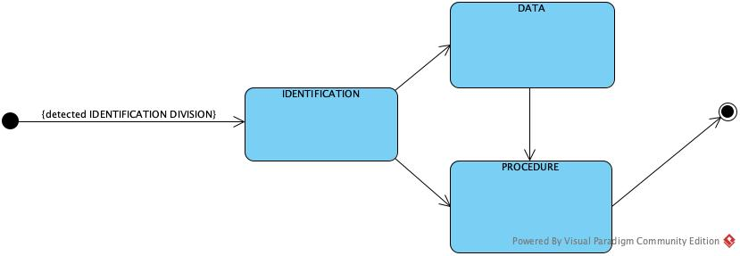
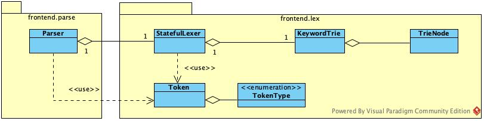

# News

2024-03-07

Giulia's updates:
* Uploaded first primer of project structure
* Includes a package for lexing
* Class dedicated to pre-processing of the source file
  * Removes empty lines at beginning and end of the file
  * Examines first 6 columns to check if there are given line numbers or blank, reports issue otherwise
  * Checks the indicator column (7) for comments or line continuation, if another character is present either than these 2 or a blank reports an error
  * Extracts the portion of the line corresponding to code (from char 8 to 72) and saves the starting position of the code line (aka the position of the first non-blank character -> to check if code starts in area A or B later)
  * By design, LineIssues are not exceptions: the idea is to collect as much issues as possible before the program stops the execution
* Usage of Trie structure for keywords detection
  * KeywordTrie and TrieNode classes
  * The Trie can be traversed char by char while scanning for tokens to check if a token is a keyword, otherwise it is recognised as an identifier/other token
  * Note: still immature, more keywords to add and possibly optimizations for memory consumptions -> later on
* Unit tests for correctness of these classes

2024-03-20

Giulia's updates:
* Substituted the Scanner class with the StatefulLexer class: the idea is to have a lexer that can produce different kind of tokens with a bit of context of the current division the program is currently in, since the different divisions can have very different syntax. It is responsability of the parser to change the state and detect illegal transitions.

* Lexing is done on demand: parser asks the lexer for the next token until it reaches EOF
* Overview of the classes

* Added more unit tests
* Added files for tracking progress and addional docs in folder "additional"
* Progress on various features, see [Features](features.md)

